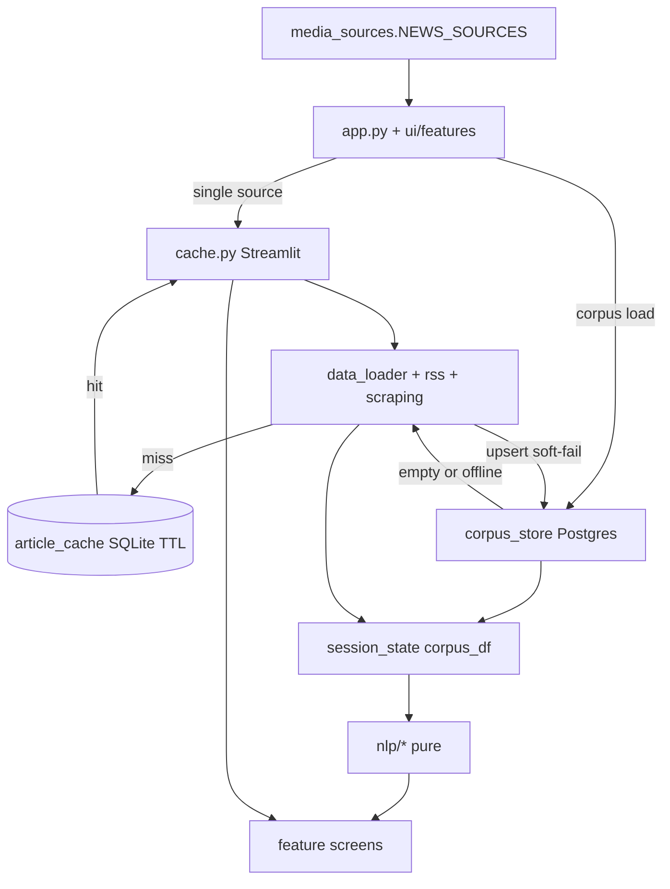
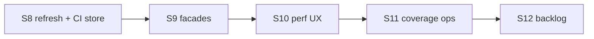

# UkrMediaNLP — аудит і roadmap після S7

> **COMPLETED (S8–S11):** Force-refresh, Postgres CI, façades/UX/coverage — see [`2026-08-04-post-s11-roadmap.md`](2026-08-04-post-s11-roadmap.md) for S12+.

> **For agentic workers:** Parent roadmap after S1–S7. Each sprint (S8+) should get its own `writing-plans` plan. Do not implement everything in one PR.

**Дата:** 2026-08-03 · **База:** `main` (S7 durable corpus) · **Фокус:** збалансований — Reliability → Architecture → Perf/UX → Ops

**Supersedes:** [`2026-08-02-project-audit-roadmap.md`](2026-08-02-project-audit-roadmap.md) (описував до-S7 стан: `app.py` ~873, cov 60%, відкриті P0 SSRF).
**Next roadmap:** [`2026-08-04-post-s11-roadmap.md`](2026-08-04-post-s11-roadmap.md).

**Goal:** Закрити P0 свіжості корпусу й надійності store CI/Docker; прибрати architectural façades; підняти perf/UX і ops-сигнали.

**Architecture:** Streamlit UI → cache/data_loader → rss/scraping → session/Postgres corpus → nlp/* → ui features. Core NLP/ingestion stay Streamlit-free. SQLite TTL ≠ durable Postgres.

**Tech stack:** Python 3.11/3.12, Streamlit, pandas, spaCy, scikit-learn, optional transformers/torch, SQLAlchemy/Postgres, pytest, ruff, Docker Compose.

## Global Constraints

- Prefer pure `nlp/*` / ingestion changes with unit tests; keep Streamlit out of core modules
- TDD for store refresh and CI Postgres work
- Do not enable `ALLOW_HEAVY_NLP=1` as Cloud free-tier default
- No embeddings / semantic search until S8 refresh is stable
- Commit frequently; keep PRs sprint-sized

---

## Поточна архітектура

| Шар | Ключові файли | Роль |
|-----|----------------|------|
| Entry | `streamlit_app.py`, `app.py` (~263 LOC) | Router |
| UI | `ui/features/`, `ui/corpus_controls.py` | Екрани + корпус |
| Ingest | `rss.py`, `scraping.py`, `data_loader.py` | RSS + scrape + SSRF |
| Кеш | `article_cache.py` | SQLite TTL (не історія) |
| Store | `corpus_store/`, `alembic/` | Postgres upsert / 90d / ingest |
| NLP | `nlp/` | Без Streamlit |
| Фасади | `config.py`, `nlp_analysis.py`, `nlp/sentiment.py` | Compat re-exports |

**Два сховища (навмисно різні):** SQLite = прискорювач скрейпу; Postgres = аналітичний корпус.

---

## Що вже зроблено (S1–S7)

| Sprint | Статус | Суть |
|--------|--------|------|
| S1 SSRF | Done | Allowlist без `com.ua`; hop-by-hop redirects |
| S2 Soft-fail / observability | Done | `NLPAnalysisError`, `log_step`, scrape captions |
| S3 Split app | Done | `ui/features/*`, тонкий `app.py` |
| S4 Corpus perf | Done | `search_blob`, vectorized search, parallel load |
| S5 CI/Docker | Done | cov ≥65% + `ui/*`, `full-nlp`, sample URLs |
| S6 Config/sentiment | Done | `media_sources.py`, sentiment modules |
| S7 Durable corpus | Done | Postgres, UI prefer/upsert/CSV, ingest, rate |

---

## Актуальні прогалини

### P0 — Reliability
1. Prefer-store блокує «оновити» (`ui/corpus_controls.py`)
2. Немає Postgres у CI unit
3. Docker migrate soft-fail у `scripts/docker_entrypoint.sh`
4. Scraper health тягне torch + усі 29 джерел

### P1 — Architecture / Perf / UX
1. `nlp_analysis.py` → `ui.renderers`
2. Dual import path `config` ↔ `media_sources`
3. Wide sentiment re-exports; upsert `iterrows`; thin light/heavy UX; low `render_*` coverage; cloud-deps без cov gate

### P2 — Ops / docs
1. Stale README test count / superseded audit roadmap
2. Dev Postgres default credentials
3. Optional mypy / SBOM

---

## Sprint roadmap

### S8 — Corpus refresh + store reliability (P0)
Force RSS checkbox; Postgres CI service + dialect tests; fail alembic on Docker start when `DATABASE_URL` set.

### S9 — Facade cleanup (P1)
Remove `nlp_analysis → ui`; prefer `media_sources` imports; narrow `nlp.sentiment` `__all__`.

### S10 — Ingest/upsert perf + corpus UX (P1)
`itertuples` upsert; light/heavy sidebar caption; rate chart labels.

### S11 — Coverage + health ops (P1/P2)
Cov fail-under 70%; cloud-deps cov gate; lighter scraper-health deps; README sync.

### S12+ backlog
mypy on store/url_utils; prod secrets; embeddings after S8; typed errors vs broad `except`.

| Критерій | Ціль |
|----------|------|
| Тести | `pytest -m "not slow"` green; + postgres smoke у CI |
| Coverage | ≥70% після S11 |
| UX корпусу | Store prefer **і** force RSS refresh |
| Архітектура | Немає Streamlit імпортів з NLP-фасаду |
| Docs | Цей roadmap актуальний; README синхронний |
