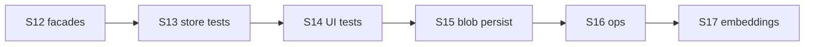

# UkrMediaNLP — аудит і roadmap після S11

> **For agentic workers:** Parent roadmap after S1–S11. Each sprint (S12+) should get its own `writing-plans` plan. Do not implement everything in one PR.

**Дата:** 2026-08-04 · **База:** `main@daa1218` (CI Tests green) · **Джерел:** 28 · **Фокус:** Architecture → Store tests → UI depth → Perf persist → Ops → Embeddings

**Supersedes for next sprints:** [`2026-08-03-post-s7-roadmap.md`](2026-08-03-post-s7-roadmap.md) (S8–S11 complete in code).

**Goal:** Finish façades/typed errors, deepen Postgres/UI tests, persist search blobs, harden ops, then embeddings.

**Architecture:** Streamlit UI → cache/data_loader → rss/scraping → session/Postgres corpus → nlp/* → ui features. Core NLP/ingestion stay Streamlit-free. SQLite TTL ≠ durable Postgres.

**Tech stack:** Python 3.11/3.12, Streamlit, pandas, spaCy, scikit-learn, optional transformers/torch, SQLAlchemy/Postgres, pytest, ruff, Docker Compose.

## Global Constraints

- Prefer pure `nlp/*` / ingestion changes with unit tests; keep Streamlit out of core modules
- TDD for store and façade work
- Do not enable `ALLOW_HEAVY_NLP=1` as Cloud free-tier default
- Embeddings only after store dialect tests are green (S13)
- Commit frequently; keep PRs sprint-sized

## Sprint status

| Sprint | Status |
|--------|--------|
| S1–S11 | Done |
| S12 Typed errors + façade finish | Done |
| S13 Store / dialect coverage | Done |
| S14 UI test depth | Done |
| S15 Corpus compute persistence | Done |
| S16 Ops readiness | Done |
| S17 Embeddings / semantic search | Done (hash fallback; ALLOW_EMBEDDINGS=0 default) |

## Sprint roadmap S12–S17

### S12 — Typed errors + façade finish
Hot-path errors → `DataLoaderError` / `NLPAnalysisError`; prefer `media_sources` imports; deprecate `nlp_analysis` for app.

### S13 — Store / dialect coverage
Expand postgres-marked tests; README secrets note.

### S14 — UI test depth
Direct `ui.features` mock-st smokes.

### S15 — Corpus compute persistence
Optional `search_blob` column; skip recompute on store load; remove leftover `iterrows`.

### S16 — Ops readiness
Compose password from env; scraper-health subset; dependabot; optional mypy.

### S17 — Embeddings / semantic search
`nlp/embeddings.py` module; Cloud off by default.

