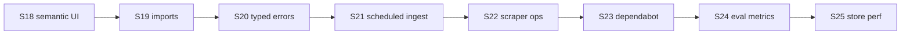

# UkrMediaNLP — аудит і roadmap після S17

> **For agentic workers:** Parent roadmap after S1–S17. Each sprint (S18+) needs its own `writing-plans` plan. Do not implement everything in one PR.

**Дата:** 2026-08-10 · **База:** `main@d2d628c` · **Джерел:** 28 · **Тестів:** ~356 · **Фокус:** Product → Architecture → Ops → Quality

**Supersedes for next sprints:** [`2026-08-04-post-s11-roadmap.md`](2026-08-04-post-s11-roadmap.md) (S12–S17 complete in code).

**Goal:** Productize semantic search, finish import/façade hygiene, harden ops, improve eval and supply chain.

**Architecture:** Streamlit UI → cache/data_loader → rss/scraping → session/Postgres corpus → nlp/* → ui features. Core NLP/ingestion stay Streamlit-free. SQLite TTL ≠ durable Postgres.

**Tech stack:** Python 3.11/3.12, Streamlit, pandas, spaCy, scikit-learn, optional transformers/torch, SQLAlchemy/Postgres, pytest, ruff, mypy (partial), Docker Compose.

## Global Constraints

- Prefer pure `nlp/*` / ingestion changes with unit tests; keep Streamlit out of core modules
- TDD for store and search work
- Do not enable `ALLOW_HEAVY_NLP=1` or `ALLOW_EMBEDDINGS=1` as Cloud free-tier defaults
- Sprint-sized PRs; commit frequently
- No Streamlit replacement or multi-tenant auth in S18–S24 scope

---

## Поточний стан (аудит 2026-08-10)

### Сильні сторони

| Область | Статус |
|---------|--------|
| Шари UI / NLP / store розділені | ✅ |
| Durable corpus + `search_blob` persist | ✅ |
| SSRF + redirect validation | ✅ |
| CI: Postgres, alembic, cov ≥70%, ruff, mypy (partial) | ✅ |
| Light Cloud без torch | ✅ |
| `iterrows` у prod-коді | ✅ прибрано |

### Прогалини

| Пріоритет | Проблема |
|-----------|----------|
| **P1** | `nlp/embeddings.py` є, UI search — лише keyword |
| **P1** | Dual import: `config` re-export vs canonical `media_sources` |
| **P1** | ~151 `except Exception`; core layers маскують помилки |
| **P1** | `nlp_analysis.py` deprecated shim лишився |
| **P2** | Немає scheduled ingest GHA |
| **P2** | Scraper-health subset 5/28; flaky live RSS |
| **P2** | Dependabot PRs без triage; немає lockfile/SBOM |
| **P2** | mypy лише `corpus_store` + `url_utils` |
| **P2** | Немає eval fixtures для sentiment quality |
| **P3** | REST API, pgvector index, Streamlit replacement — backlog |

---

## Sprint status

| Sprint | Status | Notes |
|--------|--------|-------|
| S1–S17 | Done | See post-S11 roadmap |
| S18 Semantic search UI | Planned | [`2026-08-10-semantic-search-s18.md`](2026-08-10-semantic-search-s18.md) |
| S19 Import hygiene | Planned | |
| S20 Typed errors (core) | Planned | |
| S21 Scheduled ingest | Planned | |
| S22 Scraper reliability | Planned | |
| S23 Supply chain | Planned | |
| S24 Eval & observability | Planned | |
| S25 Store perf (optional) | Backlog | |
| S26 Static typing expansion | Backlog | |
| S27 Coverage depth | Backlog | |

---

## Sprint roadmap S18–S24

### S18 — Semantic search productization (P1)

- UI mode у `corpus_search.py`: keyword vs semantic
- `nlp/corpus.py`: `search_corpus_semantic()` — cosine rank via `nlp.embeddings`
- Disabled by default (`ALLOW_EMBEDDINGS=0`); caption when off
- Tests: core ranking + UI mock smoke
- **Not in scope:** pgvector, sentence-transformers backend (S25+)

### S19 — Import hygiene & façade removal (P1)

- Migrate imports → `media_sources`; slim `config.py` to caps/env
- Remove `nlp_analysis.py` after deprecation window
- Move `get_cloud_light()` out of Streamlit-coupled config
- Tests: import graph, AST guards

### S20 — Typed errors in non-UI layers (P1)

- `nlp/corpus.py`, `corpus_store/repository.py`, `data_loader.py`: typed first
- UI keeps soft-fail for Streamlit UX
- Target: ≥50% fewer broad `except Exception` in `nlp/` + `corpus_store/`

### S21 — Scheduled corpus operations (P2)

- GHA cron: ingest dry-run daily, real ingest weekly (secrets)
- Post-ingest purge smoke
- Failure notification (workflow summary / issue)

### S22 — Scraper reliability (P2)

- Retry + fixture URLs for flaky sources
- JSON artifact per run (per-source scrape rate)
- Full 28 sources on `workflow_dispatch` + alert on subset failure

### S23 — Supply chain (P2)

- Triage Dependabot PRs (actions v7, minor pip)
- Add lockfile (`pip-tools` or `uv.lock`)
- Optional SBOM step in CI

### S24 — Evaluation & observability (P2)

- `data/fixtures/sentiment_labeled.csv` (50–100 headlines)
- pytest benchmark: rule-based vs RoBERTa vs news baseline
- README metrics table

---

## Backlog (S25+)

| Sprint | Focus |
|--------|-------|
| S25 | Store perf: batch upsert/COPY; optional lemma column; Postgres FTS/GIN |
| S26 | mypy on `data_loader`, `rss`, `scraping`, `nlp/corpus.py` |
| S27 | Router integration tests; cov ≥75% or documented omit rationale |
| — | REST API (FastAPI), pgvector, Streamlit replacement — strategic only |

---

## Quick wins (1–3 days each)

1. README: ~356 tests, `ALLOW_EMBEDDINGS` row
2. Merge green Dependabot actions PRs (checkout/setup-python/upload-artifact v7)
3. Scraper-health JSON artifact upload
4. `MAX_CORPUS_LEMMA_ROWS` env cap in `ensure_lemma_blobs`

---

## Критерії успіху (Q3 2026)

| Критерій | Ціль |
|----------|------|
| CI | Tests green; dependabot triaged |
| Product | Semantic search toggle in UI |
| Code | No required `nlp_analysis`; fewer broad except in core |
| Ops | Weekly ingest + scraper trend artifact |
| Quality | Sentiment baseline metrics in docs |

---

## Артефакти

1. This document — parent roadmap S18+
2. First implementation plan — S18 via [`2026-08-10-semantic-search-s18.md`](2026-08-10-semantic-search-s18.md)
3. Execution — subagent-driven or inline per sprint
