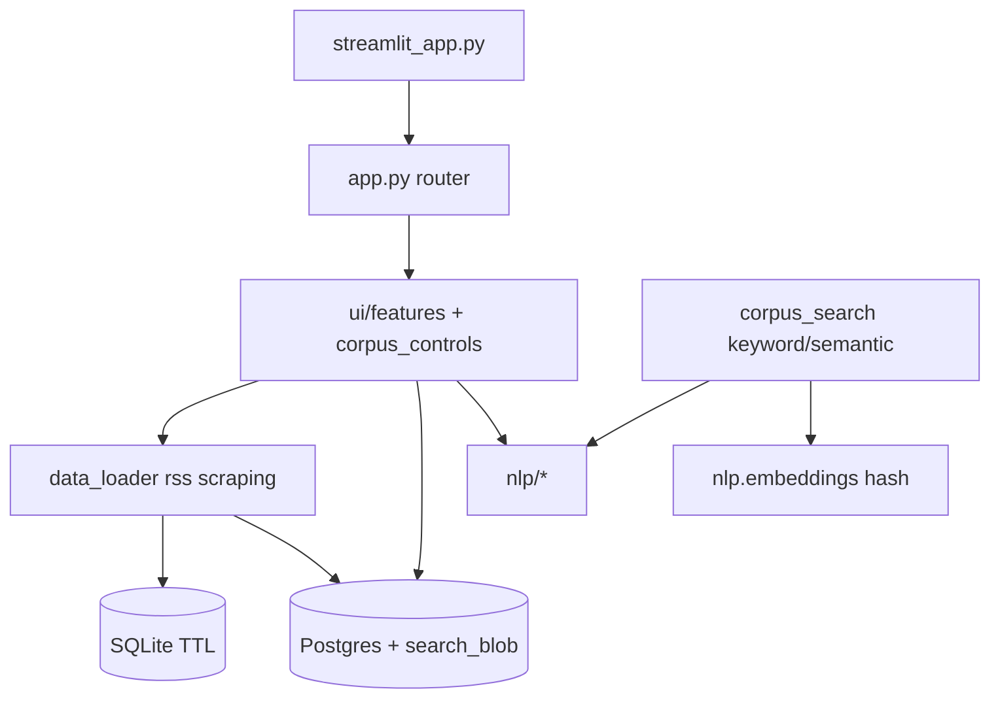
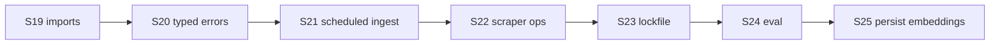

# UkrMediaNLP — аудит і roadmap після S18

> **For agentic workers:** Parent roadmap after S1–S18. Each sprint (S19+) needs its own `writing-plans` plan. Do not implement everything in one PR.

**Дата:** 2026-08-19 · **База:** `main@775631f` · **Джерел:** 28 · **Тестів:** ~368 · **Фокус:** Architecture → Typed errors → Ops → Quality

**Supersedes for next sprints:** [`2026-08-10-post-s17-roadmap.md`](2026-08-10-post-s17-roadmap.md) (S18 semantic search complete in code).

**Goal:** Finish import/façade hygiene, tighten core error handling, then ops (ingest + scraper), supply chain, and eval metrics.

**Architecture:** Streamlit UI → cache/data_loader → rss/scraping → session/Postgres corpus → nlp/* → ui features. Core NLP/ingestion stay Streamlit-free. SQLite TTL ≠ durable Postgres. Semantic search is in-memory cosine over hash embeddings (`ALLOW_EMBEDDINGS=1`).

**Tech stack:** Python 3.11/3.12, Streamlit, pandas, spaCy, scikit-learn, optional transformers/torch, SQLAlchemy/Postgres, pytest, ruff, mypy (partial), Docker Compose.

## Global Constraints

- Prefer pure `nlp/*` / ingestion changes with unit tests; keep Streamlit out of core modules
- TDD for store and façade work
- Do not enable `ALLOW_HEAVY_NLP=1` or `ALLOW_EMBEDDINGS=1` as Cloud free-tier defaults
- Sprint-sized PRs; commit frequently
- No Streamlit replacement or multi-tenant auth in S19–S24 scope

---

## Поточний стан (аудит 2026-08-19)

### Сильні сторони

| Область | Статус |
|---------|--------|
| Шари UI / NLP / store | ✅ |
| Durable corpus + `search_blob` persist | ✅ |
| Semantic search UI (S18) | ✅ keyword + semantic; typed errors |
| SSRF + redirect validation | ✅ |
| CI: Postgres, alembic, cov ≥70%, ruff, mypy (partial) | ✅ |
| Light Cloud без torch | ✅ |
| `iterrows` у prod | ✅ відсутній |

### Прогалини

| Пріоритет | Проблема | Де |
|-----------|----------|-----|
| **P1** | Dual import: caps з `config`, registry canonical у `media_sources`; `config` ще re-export NEWS_SOURCES | `cache.py`, `config.py` `__all__` |
| **P1** | `get_cloud_light()` імпортує Streamlit | `config.py` |
| **P1** | `nlp_analysis.py` deprecated shim | лише тести AST |
| **P1** | ~160 `except Exception` (core: `nlp/corpus.py` 15, `repository.py` 9, `app.py` 12) | NLP / store / UI |
| **P2** | Немає scheduled ingest GHA | лише compose profile |
| **P2** | Scraper-health subset 5/28 | `.github/workflows/scraper-health.yml` |
| **P2** | Немає lockfile / SBOM; Dependabot triage | `.github/dependabot.yml` |
| **P2** | mypy лише `corpus_store` + `url_utils.py` | `mypy.ini` |
| **P2** | README «~310 тестів» застаріло (~368) | `README.md` |
| **P2** | Немає eval fixtures для sentiment | — |
| **P2** | Semantic vectors не persist; lemma без row cap | S18 YAGNI / `ensure_lemma_blobs` |
| **P3** | REST API, pgvector, Streamlit replacement | backlog |

---

## Sprint status

| Sprint | Status | Notes |
|--------|--------|-------|
| S1–S17 | Done | post-S11 / post-S17 docs |
| S18 Semantic search UI | Done | `search_corpus_semantic` + UI toggle + tests |
| S19 Import hygiene | Planned | [`2026-08-19-import-hygiene-s19.md`](2026-08-19-import-hygiene-s19.md) |
| S20 Typed errors (core) | Planned | |
| S21 Scheduled ingest | Planned | |
| S22 Scraper reliability | Planned | |
| S23 Supply chain | Planned | |
| S24 Eval & observability | Planned | |
| S25 Store / semantic persist | Backlog | |
| S26 Static typing expansion | Backlog | |
| S27 Coverage depth | Backlog | |

---

## Sprint roadmap S19–S24

### S19 — Import hygiene & façade removal (P1)

- Slim `config.py`: caps/env/NLP lists only; drop registry from `__all__` or document-only re-export
- `get_cloud_light()` → `runtime_env.py` (or env-only helper); secrets still optional
- Delete `nlp_analysis.py`; update AST tests
- `cache.py`: `get_source_config` from `media_sources`
- **Done when:** no prod `from nlp_analysis import`; `config` does not import Streamlit at module load

### S20 — Typed errors in non-UI layers (P1)

- `nlp/corpus.py`, `corpus_store/repository.py`, `data_loader.py`: typed first
- UI keeps Streamlit soft-fail
- Target: ≥50% fewer broad `except Exception` in `nlp/` + `corpus_store/`

### S21 — Scheduled corpus operations (P2)

- GHA cron: ingest dry-run daily; real ingest weekly (secrets)
- Post-ingest purge smoke + workflow summary

### S22 — Scraper reliability (P2)

- JSON artifact per run; fixture URLs for flaky sources
- Full 28 on `workflow_dispatch`; alert on subset failure

### S23 — Supply chain (P2)

- Triage Dependabot; lockfile (`uv.lock` or pip-tools)
- Optional SBOM in CI

### S24 — Evaluation & observability (P2)

- `data/fixtures/sentiment_labeled.csv` (50–100 headlines)
- pytest: rule-based vs news baseline (RoBERTa optional/slow)
- README metrics table

---

## Backlog (S25+)

| Sprint | Focus |
|--------|-------|
| S25 | Persist embeddings / lemma blobs; Postgres FTS/GIN; batch upsert |
| S26 | mypy on `data_loader`, `rss`, `scraping`, `nlp/corpus.py` |
| S27 | Router tests; cov ≥75% or documented omit |
| — | REST API, pgvector, Streamlit replacement — strategic |

---

## Оптимізація коду (конкретні кроки)

| Крок | Файл | Дія |
|------|------|-----|
| 1 | `config.py` | Прибрати lazy `import streamlit` з `get_cloud_light` |
| 2 | `nlp_analysis.py` | Видалити після AST-тестів |
| 3 | `nlp/corpus.py` | `MAX_CORPUS_LEMMA_ROWS` cap у `ensure_lemma_blobs` |
| 4 | `corpus_store/repository.py` | Batch upsert / COPY для ingest |
| 5 | `search_corpus_semantic` | Не embed увесь корпус на кожен запит, якщо з’явиться persist (S25) |
| 6 | README | Тестів ~368; не 310 |

---

## Quick wins (1–3 дні)

1. README: ~368 тестів
2. `MAX_CORPUS_LEMMA_ROWS` env
3. Scraper-health JSON artifact
4. Dependabot actions PRs (якщо ще відкриті)

---

## Критерії успіху (Q4 2026)

| Критерій | Ціль |
|----------|------|
| CI | Tests green; dependabot triaged |
| Code | Немає обов’язкового `nlp_analysis`; `config` без Streamlit import |
| Core errors | Менше broad except у `nlp/` + `corpus_store/` |
| Ops | Weekly ingest + scraper JSON artifact |
| Quality | Sentiment baseline у docs |

---

## Артефакти

1. This document — parent roadmap S19+
2. First implementation plan — S19 [`2026-08-19-import-hygiene-s19.md`](2026-08-19-import-hygiene-s19.md)
3. Execution — subagent-driven or inline per sprint
